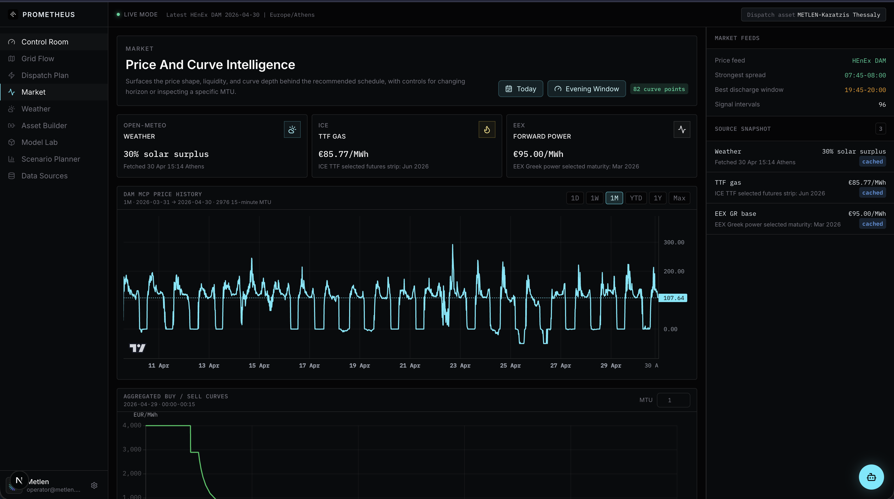
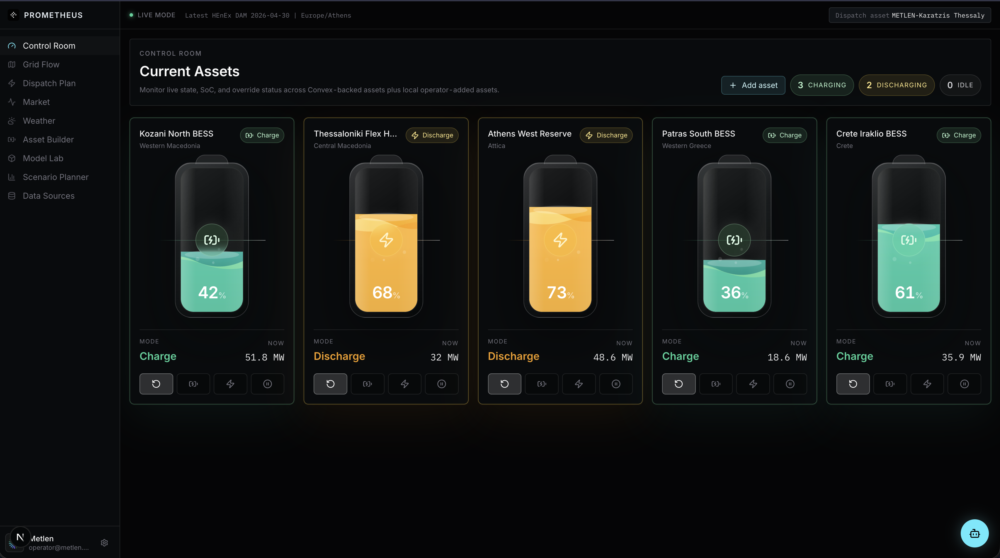
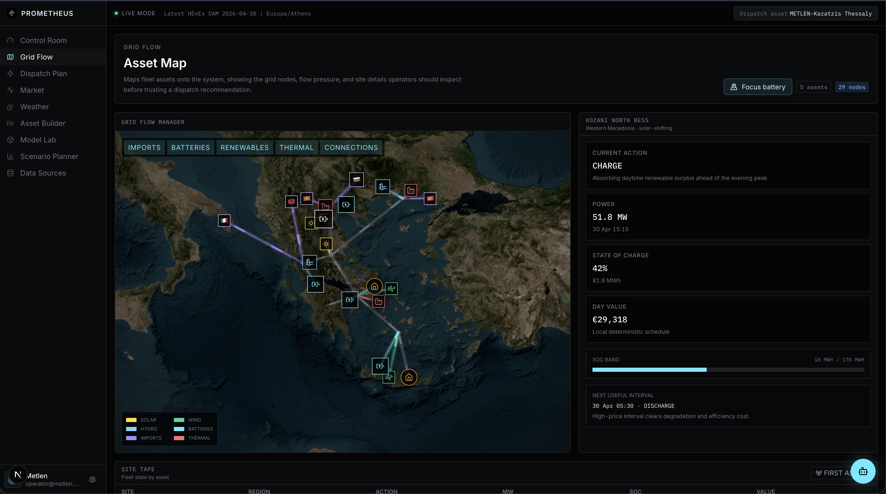

# Prometheus: Battery Intelligence OS

Prometheus is a hackathon prototype for battery dispatch optimization in the Greek electricity market. It combines market-data ingestion, price forecasting, MILP battery scheduling, walk-forward backtesting, stress-test scenarios, and an operator-facing cockpit.

The central design assumption is realistic data scarcity: we have rich market history, but limited asset-specific battery telemetry. The product therefore separates observed market data, forecast fundamentals, contextual signals, and confidence-rated battery-twin assumptions.

## Demo Video

[](https://youtu.be/BHm14HQquAE)

Watch on YouTube: [Dispatch Plan demo](https://youtu.be/BHm14HQquAE)

Local MP4 copy for GitHub/repo viewers: [docs/media/dispatch-plan-demo.mp4](docs/media/dispatch-plan-demo.mp4)

<video src="docs/media/dispatch-plan-demo.mp4" controls width="100%"></video>

## Demo Screenshots

### Control Room



### Grid Flow



### Dispatch Plan



## What It Does

- Forecasts Greek Day-Ahead Market prices with a LightGBM quantile model.
- Optimizes battery charge, discharge, and idle decisions with a HiGHS MILP scheduler.
- Enforces battery constraints: SoC bounds, power limits, round-trip efficiency, terminal SoC, cycle caps, and no simultaneous charge/discharge.
- Backtests forecast-driven dispatch against realized DAM prices and a perfect-foresight upper bound.
- Runs stress scenarios for gas shock, heatwave derating, and high forecast uncertainty.
- Exposes a source registry so judges can see exactly which data feeds are connected and how each one is used.
- Provides an operator copilot backed by cockpit artifacts, with an OpenAI route when `OPENAI_API_KEY` is configured and deterministic local fallback when it is not.

## Current Demo Metrics

These values come from the cached demo artifacts in `public/demo_artifacts/`.

### Forecast Model

- Model: `lightgbm_quantile_walk_forward_v1`
- Walk-forward folds: `60`
- Feature set: DAM price lags, calendar, realized volatility, lagged DAM market depth, ENTSO-E load and RES forecasts, residual load
- MAE: `26.005 EUR/MWh`
- RMSE: `37.256 EUR/MWh`
- p10-p90 coverage: `64.0%`
- Directional accuracy: `73.6%`

### Battery Backtest

- Backtest period: `2021-05-14` to `2026-04-17`
- Forecast-driven capture rate: `74.6%` of perfect-foresight value
- Feasibility violations: `0`
- Sharpe: `23.207`
- Max drawdown: `-56,381 EUR`
- Risk-aware capture rate: `62.8%`
- Risk-aware max drawdown: `-30,323 EUR`

The `74.6%` value is not forecast accuracy. It is:

```text
realized value from forecast-driven dispatch / realized value from perfect-foresight dispatch
```

## Data Provenance

### Market Prices and DAM Depth

The main market data comes from published Greek Day-Ahead Market results from HEnEx/ENEX. The normalized rows include:

- market date
- MTU
- clearing price
- duration
- traded volume and source metadata

These rows are used as the realized price series for model training and backtesting. We also derive lagged market-depth features from the DAM result data, including buy volume, sell volume, total volume, and rolling depth. These are full-history model features because they are available across the walk-forward backtest frame.

### Load and Renewable Forecasts

ENTSO-E provides Greek load and renewable forecast features. These are used as model inputs:

- load forecast
- solar forecast
- wind forecast
- total RES forecast
- residual load, defined as load minus renewable generation
- RES share

Residual load is a key power-price driver because it approximates the net demand that must be met by dispatchable generation.

### Supporting Context

Some sources are useful operational context but are not claimed as full-history backtest features:

- Open-Meteo weather: near-term solar, wind, and demand-stress context
- ICE TTF gas: thermal marginal-cost and scarcity context
- EEX EUA carbon: carbon-cost context for thermal price pressure

The UI labels these as context unless coverage is complete enough to include in walk-forward validation.

## Battery Asset Data

The demo asset is `METLEN-Karatzis Thessaly`.

- Power rating: `330 MW`
- Contracted energy capacity: `790 MWh`
- Approximate duration: `2.39 hours`

Those values are treated as high-confidence public project-level inputs. Other battery parameters are modeled as confidence-rated engineering assumptions:

- round-trip efficiency
- SoC operating window
- reserve SoC
- auxiliary load
- maximum cycles per day
- thermal derating
- warranty throughput
- nameplate DC energy

This is intentional. The challenge assumes limited asset-specific telemetry, so Prometheus makes the unknowns visible instead of pretending to have SCADA, warranty, cell chemistry, or degradation history for the exact battery.

## Optimization Logic

The scheduler lives in `services/optimizer/lp_dispatch.py` and uses HiGHS through `highspy`.

Decision variables:

- charge MW
- discharge MW
- SoC MWh
- binary charge/discharge indicators

Core constraints:

- SoC dynamics with split round-trip efficiency
- min/max SoC bounds
- max charge and discharge power
- no simultaneous charge and discharge
- terminal SoC
- daily cycle cap

Objective:

```text
maximize energy arbitrage revenue - degradation cost - optional uncertainty penalty
```

The risk-aware mode consumes the forecast p10-p90 band as an uncertainty penalty. It captures less upside than the balanced mode, but reduces drawdown.

## Forecasting and Backtesting

The forecast pipeline lives in `services/forecast/run_model_lab.py`.

The model is a LightGBM quantile forecast with walk-forward validation. Every test window is predicted using only earlier training data. This prevents future leakage and makes the validation closer to a real operating setting.

The backtest pipeline lives in `services/backtest/run.py`.

For each historical day:

1. Forecast DAM prices.
2. Solve the MILP battery dispatch using the forecast.
3. Score the resulting schedule against realized DAM prices.
4. Solve a second perfect-foresight schedule using realized prices.
5. Compare forecast-driven value to the perfect-foresight upper bound.

## Scenario Planner

Scenario artifacts are generated by `services/backtest/generate_demo_dispatch.py`.

Scenarios include:

- Base case: current forecast and balanced risk mode
- Gas shock: higher thermal scarcity premium
- Heatwave: power derate, lower RTE, higher auxiliary load
- High uncertainty: conservative risk mode with wider forecast sigma

Each scenario reruns the scheduler rather than merely scaling a chart. The scenario timelines show how charge and discharge windows move under stress.

## Operator Copilot

The cockpit includes a floating operator copilot.

- UI: `components/cockpit/battery-copilot.tsx`
- API route: `app/api/copilot/route.ts`
- Context: model artifacts, backtest results, optimizer scenarios, data health, external signals, battery twin, and dispatch summary

If `OPENAI_API_KEY` is configured, the copilot calls OpenAI. If the key is missing or the request fails, it falls back to deterministic local answers so the demo remains stable.

Environment variables:

```bash
OPENAI_API_KEY=...
OPENAI_MODEL=gpt-4.1-mini
```

Do not commit `.env.local`; it is ignored by `.gitignore`.

## Project Structure

```text
app/                         Next.js app routes and API routes
components/cockpit/           Cockpit views and operator copilot
convex/                       Convex schema, HTTP routes, and market adapters
data/archetypes/              Battery asset archetype YAMLs
data/entsoe/                  Cached ENTSO-E load and RES forecast data
public/demo_artifacts/        Cached model, backtest, and optimizer artifacts
services/common/              Shared Python data loaders
services/forecast/            LightGBM forecast and feature pipeline
services/optimizer/           HiGHS MILP dispatch optimizer
services/backtest/            Walk-forward battery backtest and scenario generation
services/cell_physics/        Degradation-surface interface and demo surface generation
docs/screenshots/             README screenshots captured from the live app
```

## Running Locally

Install JavaScript dependencies:

```bash
npm install
```

Start the cockpit:

```bash
npm run dev
```

If your shell does not have Node on `PATH`, use the local machine's Node path, for example:

```bash
PATH=/opt/homebrew/bin:$PATH npm run dev
```

Open:

```text
http://localhost:3000
```

## Regenerating Demo Artifacts

Run the forecast/model-lab artifact:

```bash
.venv/bin/python -m services.forecast.run_model_lab
```

Run the battery backtest:

```bash
.venv/bin/python -m services.backtest.run --asset metlen_karatzis_thessaly
```

Run the demo dispatch/scenario artifact:

```bash
.venv/bin/python -m services.backtest.generate_demo_dispatch --asset metlen_karatzis_thessaly
```

Fetch or rebuild ENTSO-E features when a token is configured:

```bash
ENTSOE_API_TOKEN=... .venv/bin/python -m services.forecast.entsoe_features
```

## Validation Commands

TypeScript:

```bash
./node_modules/.bin/tsc --noEmit
```

Frontend tests:

```bash
PATH=/opt/homebrew/bin:$PATH ./node_modules/.bin/vitest run
```

Python optimizer and forecast tests:

```bash
.venv/bin/python -m unittest services.forecast.test_run_model_lab services.optimizer.test_lp_dispatch
```

Python compile check:

```bash
.venv/bin/python -m compileall services
```

## PyBaMM and Degradation

The optimizer accepts a degradation surface through the `cell_degradation_surface` contract. That interface is compatible with a PyBaMM-generated surface or a vendor-calibrated degradation model.

For this hackathon demo, degradation is handled as an engineering throughput-cost prior in the MILP. We do not claim to have calibrated the exact cell chemistry, warranty state, or degradation history of the METLEN-Karatzis asset. Once an owner provides cell chemistry, warranty data, and telemetry, the degradation surface can replace the flat prior without changing the optimizer contract.

## Known Limits

- The battery twin uses confidence-rated assumptions where exact asset telemetry is unavailable.
- Open-Meteo, TTF, and EUA are shown as operational context, not full-history model features.
- Aggregated DAM curves are loaded for recent inspection, but not treated as a full-history model feature.
- Balancing market participation and reserve products are outside the current DAM-focused deliverable.
- PyBaMM is interface-ready but not run live in the demo.

## Pitch Summary

Prometheus demonstrates a realistic battery optimization framework for the Greek electricity market. It validates forecasts, runs constraint-aware MILP scheduling, backtests against realized DAM prices, and keeps data provenance visible. The system is designed for the real problem: rich market data, limited battery telemetry, and the need to make feasible economic decisions anyway.
